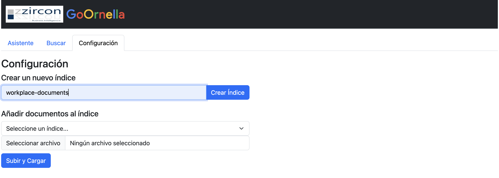
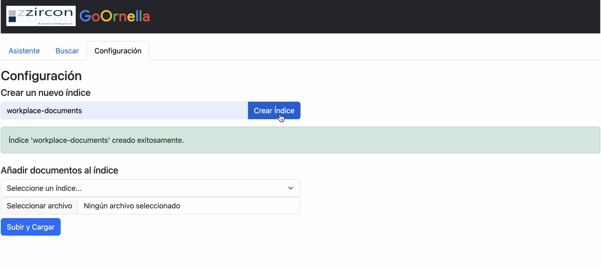
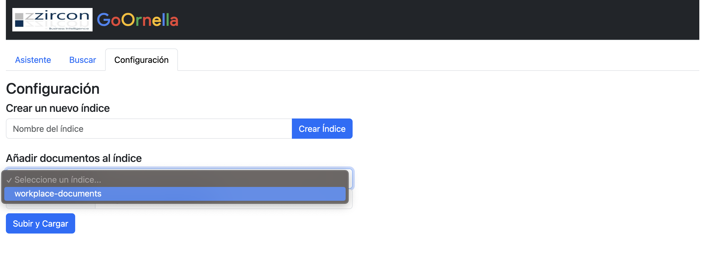
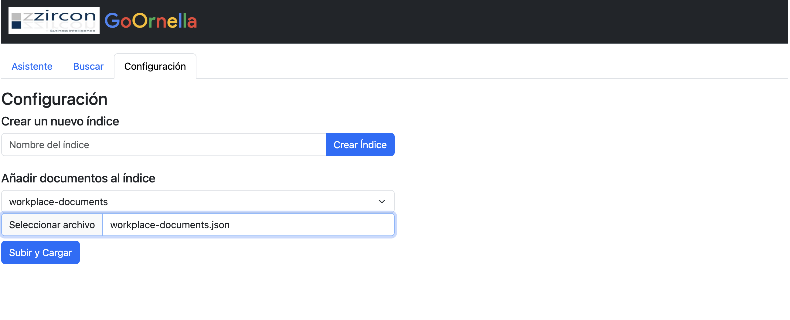
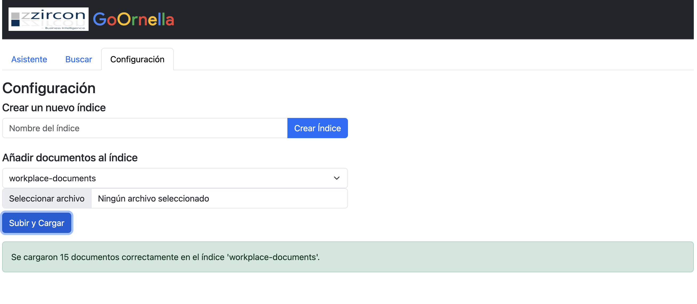
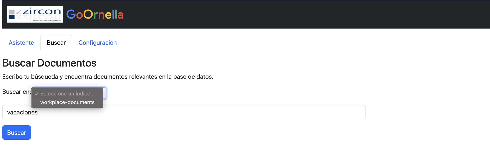
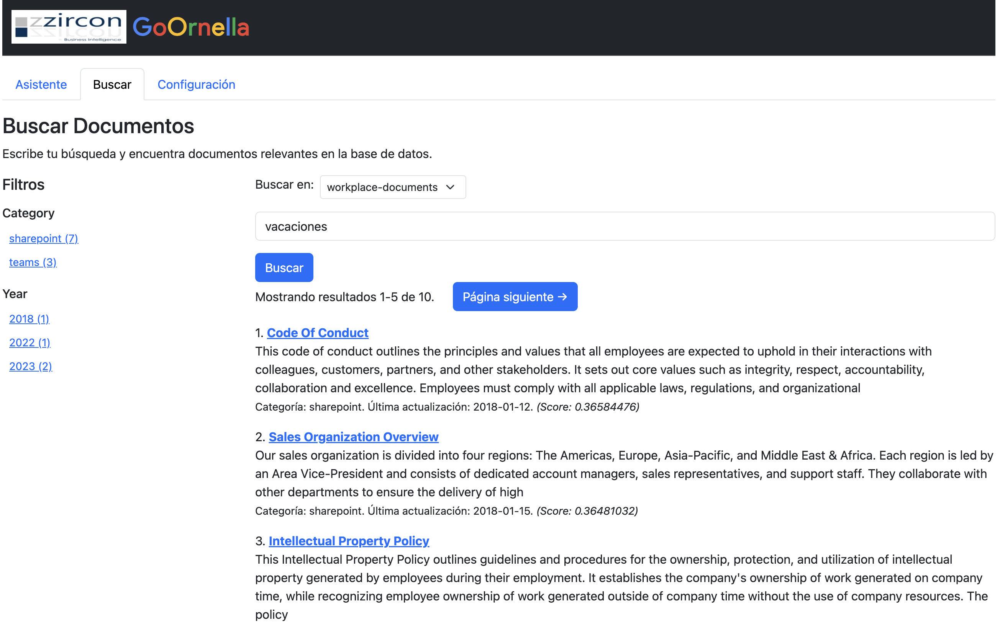
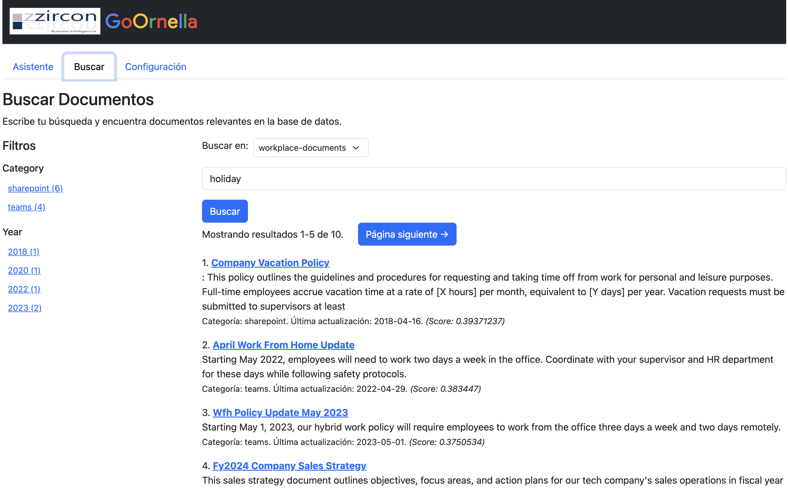
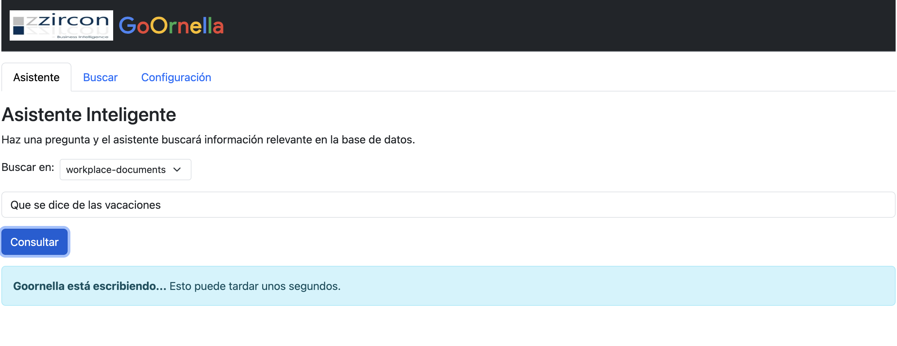
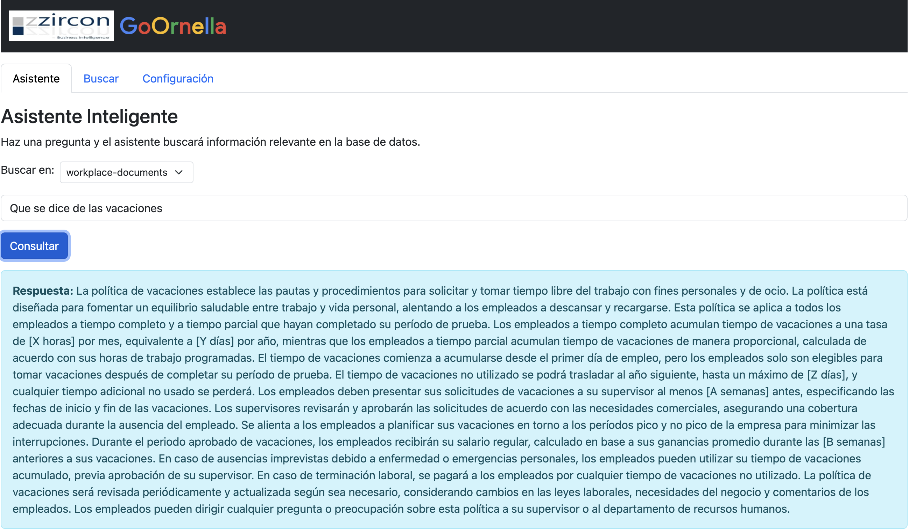

# Proyecto de Búsqueda de Documentos con Elasticsearch y Flask

## Descripción
Este proyecto es una aplicación web basada en Flask que permite realizar búsquedas en documentos almacenados en Elasticsearch. Utiliza un modelo de transformadores para generar representaciones vectoriales de los documentos y mejorar la relevancia de los resultados.

## Tecnologías Utilizadas
- Python
- Flask
- Elasticsearch
- Sentence Transformers
- HTML, CSS, Bootstrap
- Docker

## Instalación y Configuración
### 1. Clonar el Repositorio
```bash
    git clone https://github.com/jornella/Goornella.git
    cd Goornella
```

### 2. Crear un Entorno Virtual y Activarlo
```bash
    python3 -m venv venv
    source venv/bin/activate  # En Linux/macOS
    venv\Scripts\activate  # En Windows
```

### 3. Instalar Dependencias
```bash
    pip install -r requirements.txt
```

### 4. Configurar y Levantar Elasticsearch y Kibana con Docker
Para facilitar la configuración local, se incluye un archivo `docker-compose.yml` con la siguiente configuración:
```yaml
version: "3.7"
services:
  elasticsearch:
    image: docker.elastic.co/elasticsearch/elasticsearch:8.9.1
    container_name: elasticsearch
    environment:
      - discovery.type=single-node
      - ELASTIC_PASSWORD=pw
      - ES_JAVA_OPTS=-Xms2g -Xmx2g
      - xpack.security.enabled=false 
    ulimits:
      memlock:
        soft: -1
        hard: -1
    ports:
      - "9200:9200"
      - "9300:9300"
    volumes:
      - esdata:/usr/share/elasticsearch/data
    networks:
      - elastic

  kibana:
    image: docker.elastic.co/kibana/kibana:8.9.1
    container_name: kibana
    environment:
      - ELASTICSEARCH_URL=http://elasticsearch:9200
      - ELASTICSEARCH_PASSWORD=pw
    ports:
      - "5601:5601"
    volumes:
      - ./kibana/data:/usr/share/kibana/data
    networks:
      - elastic
    depends_on:
      - elasticsearch

volumes:
  esdata:
    driver: local

networks:
  elastic:
    driver: bridge
```
Para levantar el entorno de Elasticsearch y Kibana, ejecutar:
```bash
    docker-compose up -d
```

### 5. Iniciar la Aplicación Flask
```bash
    flask run
```
La aplicación estará disponible en `http://127.0.0.1:5000/`.


## Funcionalidades

### 1️⃣ Configuración y Creación del Índice
La interfaz proporciona una opción para crear el índice sin necesidad de la terminal. Solo se debe proporcionar un nombre y se generará con la siguiente estructura:
```json
{
  "mappings": {
    "properties": {
      "embedding": {
        "type": "dense_vector",
        "dims": 384
      }
    }
  }
}
```
Posteriormente, se agregarán los campos según el archivo de datos cargado.





### 2️⃣ Inserción de Documentos
Opción para cargar documentos desde un archivo JSON.
Los documentos son generados con embeddings mediante `SentenceTransformer`.






### 3️⃣ Búsqueda de Documentos
Basada en texto, similitud semántica y embeddings.
Permite filtrar por categoría y año de actualización.





### 4️⃣ Asistente Inteligente
Permite hacer consultas inteligentes y con lenguaje natural sobre los datos





## Contribución
Si deseas contribuir al proyecto, por favor sigue estos pasos:
1. Haz un fork del repositorio.
2. Crea una nueva rama (`git checkout -b nueva-funcionalidad`).
3. Realiza tus cambios y haz commit (`git commit -m "Agrega nueva funcionalidad"`).
4. Sube los cambios (`git push origin nueva-funcionalidad`).
5. Abre un Pull Request.

## Licencia
Este proyecto está basado en [este tutorial](https://github.com/elastic/elasticsearch-labs/tree/main/example-apps/search-tutorial/v3/search-tutorial) y está bajo la licencia MIT. 

Elastic tiene otros [tuturiales](https://github.com/elastic/elasticsearch-labs/blob/main/example-apps) similares en este 

Para un mejor entendimiento se puede ver en el sitio web de elastic el [tutorial](https://www.elastic.co/search-labs/tutorials/search-tutorial/welcome) paso a paso


This directory contains the Search Tutorial application featuring a semantic search solution based on the [Elastic Learned Sparse EncodeR model, or ELSER](https://www.elastic.co/guide/en/elasticsearch/reference/current/semantic-search-elser.html) model.

